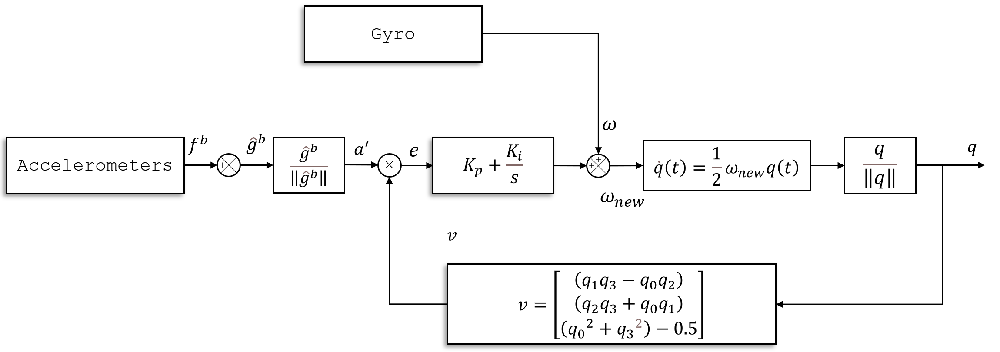
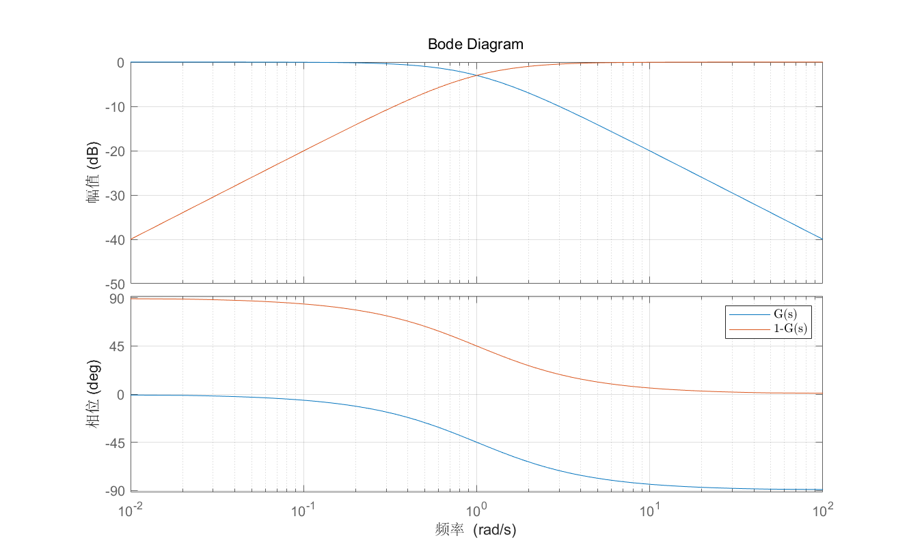

# IMU

## 姿态解算

### 基本功能

- 3轴陀螺仪

  陀螺仪，测量绕**$XYZ$**轴转动的角速度，对角速度积分可以得到角度

- 3轴加速度计

  加速度计，测量的是**$XYZ$**轴收到的加速度。在静止时，测量的是重力加速度，因此物体倾斜时根据重力的分力可以粗略计算角度。在运动时，除了重力加速度，还叠加了运动产生的加速度。
  
  **满足符合右手螺旋定则**

  

  **三轴定义如图示**
  
  

### 姿态定义

- 绕IMU**Z轴**旋转：**偏航角Yaw**，  转动**$\theta$**角度
- 绕IMU**X轴**旋转：**俯仰角Pitch**，转动**$\alpha$**角度
- 绕IMU**Y轴**旋转：**横滚角Roll**，   转动**$\beta$**角度

#### 旋转变化

##### 二维旋转变换

##### 三维旋转变换

$$
&\left[ {\begin{array}{*{20}{c}}
{\bar x}\\
{\bar y}\\
{\bar z}
\end{array}} \right] = \left[ {\begin{array}{*{20}{c}}
{\cos (\theta )}&{ - \sin (\theta )}&0\\
{\sin (\theta )}&{\cos (\theta )}&0\\
0&0&1
\end{array}} \right]\left[ {\begin{array}{*{20}{c}}
x\\
y\\
z
\end{array}} \right]
$$

- 由“绕谁谁不变”的原则，同样的方式得到$XYZ$轴旋转的公式；示意图如下

    
    
    

- 绕**$Z$轴偏航角**旋转角度为$\theta$，则旋转矩阵$R_z$为

$$
{R_z} = \left[ {\begin{array}{*{20}{c}}
{\cos (\theta )}&{ - \sin (\theta )}&0\\
{\sin (\theta )}&{\cos (\theta )}&0\\
0&0&1
\end{array}} \right]\\
$$

- 绕**$Y$轴横滚角**旋转角度为$\beta$，则旋转矩阵$R_y$为

$$
{R_y} = \left[ {\begin{array}{*{20}{c}}
{\cos (\beta )}&0&{\sin (\beta )}\\
0&1&0\\
{ - \sin (\beta )}&0&{\cos (\beta )}
\end{array}} \right]\\
$$

- 绕**$X$轴俯仰角**旋转角度为$\alpha$，则旋转矩阵$R_x$为

$$
{R_x} = \left[ {\begin{array}{*{20}{c}}
1&0&0\\
0&{\cos (\alpha )}&{ - \sin (\alpha )}\\
0&{\sin (\alpha )}&{\cos (\alpha )}
\end{array}} \right]
$$

##### 欧拉角

欧拉角是一种变化，而**不是对物体实际运动的描述**。对欧拉角的变换是顺序的，不同旋转顺序，最后得到的结果也不同

##### 欧拉角->旋转矩阵

绕三轴旋转矩阵（绕**全局坐标系**下的X轴，再绕Y轴，最后绕Z轴），则三轴旋转矩阵为：
$$
M_{XYZ}=\left[ {\begin{array}{*{20}{c}}
{\cos (\theta )}&{ - \sin (\theta )}&0\\
{\sin (\theta )}&{\cos (\theta )}&0\\
0&0&1
\end{array}} \right] \left[ {\begin{array}{*{20}{c}}
{\cos (\beta )}&0&{\sin (\beta )}\\
0&1&0\\
{ - \sin (\beta )}&0&{\cos (\beta )}
\end{array}} \right] \left[ {\begin{array}{*{20}{c}}
1&0&0\\
0&{\cos (\alpha )}&{ - \sin (\alpha )}\\
0&{\sin (\alpha )}&{\cos (\alpha )}
\end{array}} \right]\\

M_{XYZ}=\begin{bmatrix} 
\cos(\theta) \cos(\beta) & \cos(\theta) \sin(\beta) \sin(\alpha) - \sin(\theta) \cos(\alpha) & \cos(\theta) \sin(\beta) \cos(\alpha) + \sin(\theta) \sin(\alpha) \\ 
\sin(\theta) \cos(\beta) & \sin(\theta) \sin(\beta) \sin(\alpha) + \cos(\theta) \cos(\alpha) & \sin(\theta) \sin(\beta) \cos(\alpha) - \cos(\theta) \sin(\alpha) \\ 
-\sin(\beta) & \cos(\beta) \sin(\alpha) & \cos(\beta) \cos(\alpha) 
\end{bmatrix}
$$
**注意：绕轴旋转顺序不一样，得到的三轴旋转矩阵也不一样，选择合适的旋转顺序避免万向锁问题**

##### 旋转矩阵->欧拉角

利用旋转矩阵元素的相乘、相除、反三角函数等操作解算欧拉角；

- $Yaw$偏航角角度，  $Z$轴
  $$
  \theta  = \arctan2(\sin \theta \cos \beta ,\cos \theta \cos \beta ) = \arctan2(m_{21},m_{11})
  $$

- $Roll$横滚角角度，   $Y$轴

  $$
  \beta  = \arcsin (\sin \beta ) = \arcsin (-m_{31})
  $$

- $Pitch$俯仰角角度，$X$轴

  $$
  \alpha  = \arctan2(\cos \beta \sin \alpha ,\cos \beta \cos \alpha ) = \arctan2(m_{32},m_{33})
  $$

**注意：$Pitch$角度，当$sin(\beta)=\pm1$即$cos(\beta) = 0$时，欧拉角提取表达式分子分母都为0，$\arctan2$就没有意义了**，此时看起来是本地坐标系$Y$轴与全局坐标系的反方向$X$轴重合，导致的万向锁死问题[^1]

#### 四元数

欧拉旋转是有万向节锁死的问题，而四元数这个数学工具可以避免这种情况。使用单位四元数 $q = {q_0} + {q_1}i + {q_2}j + {q_3}k$ 来表示旋转，

$\left\| q \right\| = {q_0}^2 + {q_1}^2 + {q_2}^2 + {q_3}^2 = 1$

${i^2} = {j^2} = {k^2} =  - 1$

$ij =  - ji = k$

$jk =  - kj = i$

$ki =  - ik = j$

四元数的表示方式：**复数式、矢量式、三角式、指数式、矩阵式**；

##### 四元数性质[^2]

###### 共轭四元数

一个四元数$q = {q_0} + {q_1}i + {q_2}j + {q_3}k = s + \nu $的共轭表示为$\bar q = {q_0} - {q_1}i - {q_2}j - {q_3}k = s - \nu$

一个四元数和它的共轭的乘积等于自身的点乘，也等于该四元数长度的平方。即

$q\bar q = \bar qq = q \cdot q = {\left\| q \right\|^2}$

###### 四元数的逆

一个非零四元数$q$的逆$q^{-1}=\frac{\bar q}{\left\| q \right\|^2}$。显然$qq^{-1}=q^{-1}q=1$。

###### 四元数乘法

- 假设有四元数$Q = {q_0} + {q_1}i + {q_2}j + {q_3}k$和$P = {p_0} + {p_1}i + {p_2}j + {p_3}k$

$$
\begin{array}{l}
Q \times P  &= &({q_0} + {q_1}i + {q_2}j + {q_3}k)\times({p_0} + {p_1}i + {p_2}j + {p_3}k)\\
 &= &({q_0}{p_0} - {q_1}{p_1} - {q_2}{p_2} - {q_3}{p_3}) + ({q_0}{p_1} + {q_1}{p_0} + {q_2}{p_3} - {q_3}{p_2})i + \\
 & &({q_0}{p_2} - {q_1}{p_3} + {q_2}{p_0} + {q_3}{p_1})j + ({q_0}{p_3} + {q_1}{p_2} - {q_2}{p_1} + {q_3}{p_0})k
\end{array}
$$

- **矩阵式**四元数乘法；表示为$Q = {\left[ {\begin{array}{*{20}{c}}
  {{q_0}}&{{q_1}}&{{q_2}}&{{q_3}}\end{array}} \right]^T}$和$P = {\left[ {\begin{array}{*{20}{c}}
  {{p_0}}&{{p_1}}&{{p_2}}&{{p_3}}\end{array}} \right]^T}$

$$
QP = \left[ {\begin{array}{*{20}{c}}
{{q_0}}&{ - {q_1}}&{ - {q_2}}&{ - {q_3}}\\
{{q_1}}&{{q_0}}&{ - {q_3}}&{{q_2}}\\
{{q_2}}&{{q_3}}&{{q_0}}&{ - {q_1}}\\
{{q_3}}&{ - {q_2}}&{{q_1}}&{{q_0}}
\end{array}} \right]\left[ {\begin{array}{*{20}{c}}
{{p_0}}\\
{{p_1}}\\
{{p_2}}\\
{{p_3}}
\end{array}} \right] = \left[ {\begin{array}{*{20}{c}}
{{p_0}}&{ - {p_1}}&{ - {p_2}}&{ - {p_3}}\\
{{p_1}}&{{p_0}}&{{p_2}}&{ - {p_3}}\\
{{p_2}}&{ - {p_3}}&{{p_0}}&{{p_1}}\\
{{p_3}}&{{p_2}}&{ - {p_1}}&{{p_0}}
\end{array}} \right]\left[ {\begin{array}{*{20}{c}}
{{q_0}}\\
{{q_1}}\\
{{q_2}}\\
{{q_3}}
\end{array}} \right]
$$

​       注意$QP \ne PQ$

###### 四元数表示向量旋转

定义${p_v} = {\left[ {\begin{array}{*{20}{c}}
{{p_x}}&{{p_y}}&{{p_z}}\end{array}} \right]^T}$为三维空间中的一点，将其转化为纯四元数形式即$p = {\left[ {\begin{array}{*{20}{c}}
0&{{p_v}}\end{array}} \right]^T}$，令
$$
q = {\left[ {\begin{array}{*{20}{c}}
{\cos (\frac{\theta }{2})}&{v\sin (\frac{\theta }{2})}
\end{array}} \right]^T}
$$
为单位四元数，则有
$$
p' = qp{q^{ - 1}} = {\left[ {\begin{array}{*{20}{c}}
0&{{{p'}_v}}
\end{array}} \right]^T}
$$
其中${p'}$表示绕旋转轴${v}$旋转$\theta$角度后得到的新向量在**原三维空间的坐标表示**

###### **四元数表示坐标系旋转**

定义向量$v_0$在$oxyz$坐标系中的表示为$\left[ {\begin{array}{*{20}{c}}
{{v_x}}&{{v_y}}&{{v_z}}\end{array}} \right]^T$，令坐标系$oxyz$绕单位旋转轴${v}$旋转$\theta$角度，得到新坐标系$o'x'y'z'$，此时$v_0$在新坐标系中表示为$\left[ {\begin{array}{*{20}{c}}{{v'_x}}&{{v'_y}}&{{v'_z}}\end{array}} \right]^T$。转化关系为
$$
{\left[ {\begin{array}{*{20}{c}}
{\begin{array}{*{20}{c}}
0&{{{v'}_x}}
\end{array}}&{{{v'}_y}}&{{{v'}_z}}
\end{array}} \right]^T} = {q^{ - 1}}{\left[ {\begin{array}{*{20}{c}}
{\begin{array}{*{20}{c}}
0&{{v_x}}
\end{array}}&{{v_y}}&{{v_z}}
\end{array}} \right]^T}q
$$
其中$q = {\left[ {\begin{array}{*{20}{c}}{\cos (\frac{\theta }{2})}&{v\sin (\frac{\theta }{2})}\end{array}} \right]^T}$

###### 旋转矩阵	

如果用$R_b^n$来表示b系到n系的旋转矩阵，则b系中的向量${v^b}$通过左乘$R_b^n$即可转化为n系中的向量${v^n}$
$$
{v^n} = R_b^n{v^b}
$$

##### 四元数->旋转矩阵[^3]

那么给定一个单位四元数，可以构造旋转矩阵：
$$
R(q) = \left[ {\begin{array}{*{20}{c}}
{1 - 2({q_2}^2 + {q_3}^2)}&{2({q_1}{q_2} - {q_0}{q_3})}&{2({q_1}{q_3} + {q_0}{q_2})}\\
{2({q_1}{q_2} + {q_0}{q_3})}&{1 - 2({q_1}^2 + {q_3}^2)}&{2({q_2}{q_3} - {q_0}{q_1})}\\
{2({q_1}{q_3} - {q_0}{q_2})}&{2({q_2}{q_3} + {q_0}{q_1})}&{1 - 2({q_1}^2 + {q_2}^2)}
\end{array}} \right]
$$

##### 四元数->欧拉角

- $Yaw$偏航角角度，  $Z$轴
  $$
  \theta  = \arctan2({2({q_1}{q_2} + {q_0}{q_3})} ,{1 - 2({q_2}^2 + {q_3}^2)} )
  $$

- $Roll$横滚角角度，   $Y$轴

  $$
  \beta  = \arcsin (2({q_0}{q_2} - {q_1}{q_3}) )
  $$

- $Pitch$俯仰角角度，$X$轴

  $$
  \alpha  = \arctan2({2({q_2}{q_3} + {q_0}{q_1})} ,{1 - 2({q_1}^2 + {q_2}^2)} )
  $$

##### 欧拉角->四元数

- 绕$Z$轴旋转（ $Yaw$偏航角）对应的四元数为

$$
{q_z} = \left( {\cos (\frac{\theta }{2}),0,0,\sin (\frac{\theta }{2})} \right)
$$

- 绕$Y$轴旋转（  $Roll$偏航角）对应的四元数为

$$
{q_y} = \left( {\cos (\frac{\beta }{2}),0,\sin (\frac{\beta }{2}),0} \right)
$$

- 绕$X$轴旋转（ $Pitch$偏航角）对应的四元数为

$$
{q_x} = \left( {\cos (\frac{\alpha }{2}),\sin (\frac{\alpha }{2}),0,0} \right)
$$

- 最终四元数相乘得到，四元数的乘法是非交换的，以$ZYX$顺序进行相乘。

$$
q & = & {q_z} \times {q_y} \times {q_x}
  = \left[ {\begin{array}{*{20}{c}}
{\cos (\frac{\theta }{2})}\\
0\\
0\\
{\sin (\frac{\theta }{2})}
\end{array}} \right]\left[ {\begin{array}{*{20}{c}}
{\cos (\frac{\beta }{2})}\\
0\\
{\sin (\frac{\beta }{2})}\\
0
\end{array}} \right]\left[ {\begin{array}{*{20}{c}}
{\cos (\frac{\alpha }{2})}\\
{\sin (\frac{\alpha }{2})}\\
0\\
0
\end{array}} \right] \\
& = & \left[ {\begin{array}{*{20}{c}}
{\cos (\frac{\theta }{2})\cos (\frac{\beta }{2})\cos (\frac{\alpha }{2}) + \sin (\frac{\theta }{2})\sin (\frac{\beta }{2})\sin (\frac{\alpha }{2})}\\
{\cos (\frac{\theta }{2})\cos (\frac{\beta }{2})\sin (\frac{\alpha }{2}) - \sin (\frac{\theta }{2})\sin (\frac{\beta }{2})\cos (\frac{\alpha }{2})}\\
{\cos (\frac{\theta }{2})\sin (\frac{\beta }{2})\cos (\frac{\alpha }{2}) + \sin (\frac{\theta }{2})\cos (\frac{\beta }{2})\sin (\frac{\alpha }{2})}\\
{\sin (\frac{\theta }{2})\cos (\frac{\beta }{2})\cos (\frac{\alpha }{2}) - \cos (\frac{\theta }{2})\sin (\frac{\beta }{2})\sin (\frac{\alpha }{2})}
\end{array}} \right]
$$

##### 四元数微分方程

定义单位四元数$q(t)$来表示旋转关系，在$t + \Delta t$时刻，旋转可表示为$q\left( {t + \Delta t} \right)$；即在过程中，机体经过微小旋转，其瞬时旋转角速度为${\omega  = {{\left[ {\begin{array}{*{20}{c}}0&{{\omega _x}}&{{\omega _y}}&{{\omega _z}}\end{array}} \right]}^T}}$，单位化
$$
\hat \omega  = \frac{\omega }{{\left\| \omega  \right\|}}
$$
在$\Delta t$时刻转过的角度为
$$
\Delta \theta  = \Delta t\left\| \omega  \right\|
$$
则这次微小旋转可由如下形式的单位四元数表示
$$
\Delta q = \cos \frac{{\Delta \theta }}{2} + \sin \frac{{\Delta \theta }}{2}\hat \omega  = \cos \frac{{\left\| \omega  \right\|\Delta t}}{2} + \sin \frac{{\left\| \omega  \right\|\Delta t}}{2}\hat \omega
$$
连续两次的旋转可以表示为$q\left( {t + \Delta t} \right) = \Delta q \cdot q$，则有
$$
\begin{array}{l}
q\left( {t + \Delta t} \right) - q\left( t \right)& = &\left( {\cos \frac{{\left\| \omega  \right\|\Delta t}}{2} + \sin \frac{{\left\| \omega  \right\|\Delta t}}{2}\hat \omega } \right)q\left( t \right) - q\left( t \right)\\[2mm]
& = &\left( { - 2{{\sin }^2}\frac{{\left\| \omega  \right\|\Delta t}}{2} + \sin \frac{{\left\| \omega  \right\|\Delta t}}{2}\hat \omega } \right)q\left( t \right)
\end{array}
$$
省略高阶项可得
$$
\large
&q\left( {t + \Delta t} \right) - q\left( t \right) = \hat \omega \sin \frac{{\left\| \omega  \right\|\Delta t}}{2}q\left( t \right)\\[2mm]
&\begin{array}{l}
\dot q\left( t \right) &=& \mathop {\lim }\limits_{\Delta t \to \infty } \frac{{q\left( {t + \Delta t} \right) - q\left( t \right)}}{{\Delta t}} = \mathop {\lim }\limits_{\Delta t \to \infty } \frac{{\hat \omega \sin \frac{{\left\| \omega  \right\|\Delta t}}{2}}}{{\Delta t}}q\left( t \right)\\[2mm]

 &=& \frac{1}{2}\hat \omega \left\| \omega  \right\|q\left( t \right)\\[2mm]
 &=& \frac{1}{2}\omega q\left( t \right)
\end{array}
$$

### IMU姿态解算

#### 姿态解算-陀螺仪[^4]

##### 获取陀螺仪数据

测量当前的角速度${\omega  = {{\left[ {\begin{array}{*{20}{c}}0&{{\omega _x}}&{{\omega _y}}&{{\omega _z}}\end{array}} \right]}^T}}$单位弧度/秒，按照右手螺旋定则为正

##### 计算四元数导数

四元数的时间导数与角速度关系为，初始化${q = {{\left[ {\begin{array}{*{20}{c}}{q_0}&{{q_1}}&{{q_2}}&{{q_3}}\end{array}} \right]}^T} = {{\left[ {\begin{array}{*{20}{c}}1&{0}&{0}&{0}\end{array}} \right]}^T}}$
$$
\dot q = \frac{1}{2}\omega q
$$

##### 数值积分

利用如欧拉法、四阶龙格-库塔法(RK4)等数值积分方法，如下使用欧拉法更新四元数
$$
q\left( {t + \Delta t} \right) = q\left( t \right) + \dot q\left( t \right)\Delta t
$$

##### 归一化四元数

由于数值积分会引入误差，需要对四元数进行归一化
$$
{q_{new}} = \frac{{q\left( {t + \Delta t} \right)}}{{\left\| {q\left( {t + \Delta t} \right)} \right\|}}
$$

#### 姿态解算-加速度计

加速度计测量的是其感受到的加速度，在静止时，其本身是没有加速运动的，感受到的加速度与重力加速度正好相反

##### 重力计算欧拉角

绕三轴旋转矩阵（绕**全局坐标系**下的X轴，再绕Y轴，最后绕Z轴）
$$
\left[ {\begin{array}{*{20}{c}}
{{a_x}}\\
{{a_y}}\\
{{a_z}}
\end{array}} \right] = M_{XYZ}^T \cdot \left[ {\begin{array}{*{20}{c}}
0\\
0\\
g
\end{array}} \right] = \left[ {\begin{array}{*{20}{c}}
{ - \sin \beta }\\
{\cos \beta \sin \alpha }\\
{\cos \beta \cos \alpha }
\end{array}} \right] \cdot g
$$

- $Roll$横滚角角度，   $Y$轴

$$
\beta  =  - \arctan (\frac{{{a_x}}}{{\sqrt {{a_y}^2 + {a_z}^2} }})
$$

- $Pitch$俯仰角角度，$X$轴

$$
\alpha  = \arctan (\frac{{{a_y}}}{{{a_z}}})
$$

由公式可知$Yaw$偏航角的角度无法解算；实际运动中因为一般绕$Z$轴旋转，所以重力分量不会改变。

#### 注意事项

- **静态情况下**：所测量的加速度主要来自于重力分量，能较准确地计算角度。主要关注传感器校准、漂移、噪声和温度补偿
- **动态情况下**：在动态运动中，测量的加速度还包括运动产生的惯性加速度，此时的角度计算结果会存在误差。主要关注高动态范围、震动影响以及与陀螺仪和磁力计和融合
- **环境干扰**：避免强电磁干扰环境
- **数据预处理**：对数据进行归一化和滤波处理
- **设备校正**：定期校正确保测量精度
- **陀螺仪**：零点漂移、白噪声、温漂、积分误差

## 滤波算法

### Mahony滤波

**陀螺仪**解算得到的姿态具有良好的**高频特性**，但是会随着时间漂移，而**加速度计**解算得到姿态具有良好的**低频特性**，不会随着时间漂移，但是载体剧烈运动时，不能解算出真实的姿态。这时可以将陀螺仪的高频特性和加速度计的低频特性相融合，得到高频、低频特性都很好的算法。

#### 传函分析

使用$PI$控制算法进行误差补偿，其中$PI$控制器可以看作一个**低通滤波器**，它用于整合加速度计的低频信息并与陀螺仪数据互补，从而实现互补滤波效果。传递函数如下

$$
\large
\begin{array}{l}
q(s) &=& \frac{{a(s)G(s) + \omega (s)}}{{s + G(s)}}\\[2mm]
 &=& \frac{{G(s)}}{{s + G(s)}}a(s) + \frac{s}{{s + G(s)}}\frac{{\omega (s)}}{s}
\end{array}
$$

$$
\normalsize
q(s) = G'(s)a(s) + (1 - G'(s))\frac{{\omega (s)}}{s}
$$

$q$最终由$a$的低频和$\frac{\omega}{s}$的高频组成。反映了互补滤波的实质；陀螺仪积分的高频量互补加速度的低频量，最终角度在短时间内的输出主要取决于陀螺仪积分，而长时间的输出取决于加速度测量角，这样既保证了角度的精度，又保证了角度长时间的稳定性。

若原式中$G$是一个常数，那么$q$的表达式为
$$
q(s) = \frac{{{K_p}}}{{s + {K_p}}}a(s) + \frac{s}{{s + {K_p}}}\frac{{\omega (s)}}{s}
$$

其$bode$图如下

若原式中$G$是$PI$控制器，那么$q$的表达式为
$$
q(s) = \frac{{{K_p}s + {K_i}}}{{{s^2} + {K_p}s + {K_i}}}a(s) + \frac{{{s^2}}}{{{s^2} + {K_p}s + {K_i}}}\frac{{\omega (s)}}{s}
$$
其$bode$图如下

#### 误差定义

因存在积分误差、温漂、零漂等因素影响，角速度积分之后得到的角度，其角度误差会随时间越来越大。

加速度计，在静置情况下，得到的加速度是重力加速度，永远垂直向下，是一个可靠的值。所以，可以通过加速度计得到的矢量方向，与陀螺仪积分转化得到的重力加速度的方向，计算这两个矢量之间的角度误差，作为积分误差大小的一个衡量指标。

在Mahony算法中，用向量叉积来表示误差，向量叉积的模长表示为：
$$
\left| {a \times b} \right| = \left| a \right|\left| b \right|\sin \theta
$$
若$a,b$均为单位向量，则$\left| {a \times b} \right| = \sin \theta$，使用近似假设，则有
$$
\left| {a \times b} \right| = \sin \theta  \approx \theta
$$

####  加速度归一化向量

对加速度计的测量值进行归一化
$$
a' = \left[ {\begin{array}{*{20}{c}}
{{{a'}_x}}\\
{{{a'}_y}}\\
{{{a'}_z}}
\end{array}} \right] = \frac{1}{{\left| a \right|}}\left[ {\begin{array}{*{20}{c}}
{{a_x}}\\
{{a_y}}\\
{{a_z}}
\end{array}} \right]
$$

#### 当前姿态估计重力方向向量

当载体处于静止状态时，加速度计输出恒为$\left[ {\begin{array}{*{20}{c}}0\\0\\g\end{array}} \right]$。如果带入四元数形式的旋转矩阵，则有

$$
{R(q)}\left[ {\begin{array}{*{20}{c}}
{{a_x}}\\
{{a_y}}\\
{{a_z}}
\end{array}} \right] = \left[ {\begin{array}{*{20}{c}}
0\\
0\\
g
\end{array}} \right]    \left[ {\begin{array}{*{20}{c}}
{{a_x}}\\
{{a_y}}\\
{{a_z}}
\end{array}} \right] = \left[ {\begin{array}{*{20}{c}}
{2({q_1}{q_3} - {q_0}{q_2})}\\
{2({q_2}{q_3} + {q_0}{q_1})}\\
{2({q_0}^2 + {q_3}^2) - 1}
\end{array}} \right]g
$$
用$v= \left[ {\begin{array}{*{20}{c}}
{{v_x}}\\
{{v_y}}\\
{{v_z}}
\end{array}}  \right]$来表示重力方向向量
$$
v = \left[ {\begin{array}{*{20}{c}}
{{v_x}}\\
{{v_y}}\\
{{v_z}}
\end{array}} \right] = \left[ {\begin{array}{*{20}{c}}
{({q_1}{q_3} - {q_0}{q_2})}\\
{({q_2}{q_3} + {q_0}{q_1})}\\
{({q_0}^2 + {q_3}^2) - 0.5}
\end{array}} \right]
$$
此处一般使用原始向量$v$的一半，以减少乘法运算，以**滤波系数$K_p,K_i$均为两倍的比例和积分增益**。

#### 向量叉积得到误差

$$
e = a' \times v = \left[ {\begin{array}{*{20}{c}}
0&{ - {a_z}}&{{a_y}}\\
{{a_z}}&0&-{{a_x}}\\
{ - {a_y}}&{{a_x}}&0
\end{array}} \right]\left[ {\begin{array}{*{20}{c}}
{({q_1}{q_3} - {q_0}{q_2})}\\
{({q_2}{q_3} + {q_0}{q_1})}\\
{({q_0}^2 + {q_3}^2) - 0.5}
\end{array}} \right]
$$

##### 误差补偿

角速度的测量偏差补偿量，如下
$$
{\omega _{bias}} = {K_p} \cdot e + {K_i} \cdot \int e
$$
其中$K_p$为比例系数，$K_i$为积分系数。$K_p$可以表示为对加速度计的信任程度，越大越信任加速度计的测量值，反之$K_p$越小则信任陀螺仪的数据。$K_i$用于消除静态误差，也就是消除陀螺仪的零偏。

#### 姿态更新

根据修正后的角速度值，结合前文得到的四元数微分方程对姿态进行递推即可得到融合后的姿态
$$
\dot q = \frac{1}{2}(\omega + \omega_{bias})q
$$

#### 校准后调用

在调用Mahony解算程序前，需要先对陀螺仪和加速度计零偏进行估计；需要将IMU静止一段时间，获取这段时间的**均值**即为零偏估计值，在使用中减去零偏。

#### Mahony算法优缺点

##### 优点

- 计算复杂程度低
- 对静态误差的自适应能力强，能够准确地估计姿态
- PI控制参数好调整

##### 缺点

- 动态情况下，该算法的性能可能会受到影响。此时加速度计的数据不仅仅代表重力加速度，这时会导致估计误差的增加

### Madgwick滤波

Madgwick算法假设加速度计测量的加速度完全由重力提供，即物体本体运动产生的加速度可忽略不计。

Madgwick算法的本质是加权整合$t$时刻陀螺仪算出的姿态${}_E^S{q_{\omega ,t}}$和加速计磁场计共同算出的姿态${}_E^S{q_{\nabla ,t}}$，（$E(earth)$表示世界坐标系$S(sensor)$表示传感器坐标系），从而得到最终的姿态。
#### 角速度估计

通过角速度提供的数据，可以得到角速度下的四元数以下标$\omega$表示
$$
\large{{\dot q}_{\omega ,t}} = \frac{1}{2}{\omega _t}{{\hat q}_{est,t - 1}}\\[2mm]
%{}_E^S{q_{\omega ,t}} = {}_E^S{{\hat q}_{est,t - 1}} + {}_E^S{{\dot q}_{\omega ,t}}\Delta t
$$
对四元数进一步区分，将上一时刻滤波后的姿态四元数记为${{\hat q}_{est,t - 1}}$，现在已知$t-1$时刻的四元数${{\hat q}_{est,t - 1}}$和角速度${{\omega}_{t - 1}}$，以及$t$时刻的角速度${{\omega}_{t}}$，系统采样间隔为$\Delta t$，求$t$时刻的四元数，使用改进的欧拉公式。
$$
\begin{gather*}
{q_{\omega ,t}} = {{\hat q}_{est,t - 1}} + ({K_1} + {K_2})\frac{{\Delta t}}{2}\\[2mm]
{K_1} = \frac{1}{2}{\omega _{t - 1}}{{\hat q}_{est,t - 1}}\\[2mm]
{K_2} = \frac{1}{2}{\omega _t}({{\hat q}_{est,t - 1}} + \Delta t{K_1})
\end{gather*}
$$
在实际中，受传感器特性的影响，陀螺仪、加速度计、磁场计的最大采样速度不一样。系统采样间隔$\Delta t$是为了满足这三个传感器中最低的采样速度，使其能同时采样。实际上陀螺仪的采样速度可以比另外两给传感器的速度快很多。所以如果为最求更高精度，可以分开采样。假设陀螺仪的采样间隔是$\Delta t_\omega$，则可以用$\Delta t_\omega$代替上式中的$\Delta t$，用欧拉公式一步一步地往后算，重复$n$次，直到$n\Delta t_\omega = \Delta t$，就得到了高精度下一个系统采样时刻的四元数，并且这个四元数与另外两个传感器同步。

#### 加速度计估计

假设在世界坐标系下一个向量表示为$d = {\left[ {\begin{array}{*{20}{c}}0&{{d_x}}&{{d_y}}&{{d_z}}\end{array}} \right]^T}$，在传感器下的观测值为$s = {\left[ {\begin{array}{*{20}{c}}0&{{s_x}}&{{s_y}}&{{s_z}}\end{array}} \right]^T}$。若此时姿态是准确的，在单位四元数下则有
$$
\large
s = q_{_{est,t}}^{ - 1} \otimes d \otimes {q_{_{est,t}}}
$$

然而由于姿态不准确，等式并不成立。因此，定义目标函数
$$
f\left( {{\hat q}_{est,t},{\hat d},{\hat s}} \right) = {\hat q}_{est,t}^{ - 1} \otimes {\hat d} \otimes {{\hat q}_{est,t}} - {{\hat s}}
$$
令目标函数取到0（在四元数对应的参数空间上），取到最优的姿态$q_{optimal}$，即$q_{optimal}=\mathop {\min }\limits_{{q}} f\left( {d,q,s} \right)$，此处使用**梯度下降法**求解这个优化问题，记$f$的梯度为$\nabla f$，那么在**迭代优化**求解时，下一次取值应该为当前取值减去当前梯度方向走一个步长$\mu$，即
$$
%\large
{q_{est,k+1}} = {{\hat q}_{est,k}} - \mu \frac{{\nabla f\left( {{{\hat q}_{est,k}},{{\hat d}_{k}},{{\hat s}_{k}}} \right)}}{{\left\| {f\left( {{{\hat q}_{est,k}},{{\hat d}_{k}},{{\hat s}_{k}}} \right)} \right\|}}
$$

$$
f\left( {{{\hat q}_{est,k}},{{\hat d}_{k}},{{\hat s}_{k}}} \right) &=& \left[ {\begin{array}{*{20}{c}}
0\\
{2{d_x}(\frac{1}{2} - q_2^2 - q_3^2) + 2{d_y}({q_0}{q_3} + {q_1}{q_2}) + 2{d_z}({q_1}{q_3} - {q_0}{q_2}) - {s_x}}\\
{2{d_x}({q_1}{q_2} - {q_0}{q_3}) + 2{d_y}(\frac{1}{2} - q_1^2 - q_3^2) + 2{d_z}({q_0}{q_1} + {q_2}{q_3}) - {s_y}}\\
{2{d_x}({q_0}{q_2} + {q_1}{q_3}) + 2{d_y}({q_2}{q_3} - {q_0}{q_1}) + 2{d_z}(\frac{1}{2} - q_1^2 - q_2^2) - {s_z}}
\end{array}} \right]\\[2mm]
&=& \left[ {\begin{array}{*{20}{c}}
{2{d_x}(\frac{1}{2} - q_2^2 - q_3^2) + 2{d_y}({q_0}{q_3} + {q_1}{q_2}) + 2{d_z}({q_1}{q_3} - {q_0}{q_2}) - {s_x}}\\
{2{d_x}({q_1}{q_2} - {q_0}{q_3}) + 2{d_y}(\frac{1}{2} - q_1^2 - q_3^2) + 2{d_z}({q_0}{q_1} + {q_2}{q_3}) - {s_y}}\\
{2{d_x}({q_0}{q_2} + {q_1}{q_3}) + 2{d_y}({q_2}{q_3} - {q_0}{q_1}) + 2{d_z}(\frac{1}{2} - q_1^2 - q_2^2) - {s_z}}
\end{array}} \right]
$$

目标函数的雅可比矩阵表示为
$$
J\left( {{\hat q}_{est,t - 1}},{{\hat d}_{t}} \right) = \frac{{\partial f\left( {{{\hat q}_{est,t - 1}},{{\hat d}_{t}},{{\hat s}_{t}}} \right)}}{{\partial {\hat q}^T_{est,t - 1}}} = \left[ {\begin{array}{*{20}{c}}
{\begin{array}{*{20}{c}}
{\frac{{\partial {f_1}}}{{\partial {q_0}}}}&{\frac{{\partial {f_1}}}{{\partial {q_1}}}}&{\frac{{\partial {f_1}}}{{\partial {q_2}}}}&{\frac{{\partial {f_1}}}{{\partial {q_3}}}}
\end{array}}\\
 \vdots \\
{\begin{array}{*{20}{c}}
{\frac{{\partial {f_3}}}{{\partial {q_0}}}}&{\frac{{\partial {f_3}}}{{\partial {q_1}}}}&{\frac{{\partial {f_3}}}{{\partial {q_2}}}}&{\frac{{\partial {f_3}}}{{\partial {q_3}}}}
\end{array}}
\end{array}} \right]\\[2mm]
= \left[ {\begin{array}{*{20}{c}}
{2{d_y}{q_3} - 2{d_z}{q_2}}&{2{d_y}{q_2} + 2{d_z}{q_3}}&{ - 4{d_x}{q_2} + 2{d_y}{q_1} - 2{d_z}{q_0}}&{ - 4{d_x}{q_3} + 2{d_y}{q_0} + 2{d_z}{q_1}}\\
{ - 2{d_x}{q_3} + 2{d_z}{q_1}}&{2{d_x}{q_2} - 4{d_y}{q_1} + 2{d_z}{q_0}}&{2{d_x}{q_1} + 2{d_z}{q_3}}&{ - 2{d_x}{q_0} - 4{d_y}{q_3} + 2{d_z}{q_2}}\\
{2{d_x}{q_2} - 2{d_y}{q_1}}&{2{d_x}{q_3} - 2{d_y}{q_0} - 4{d_z}{q_1}}&{2{d_x}{q_0} + 2{d_y}{q_3} - 4{d_z}{q_2}}&{2{d_x}{q_1} + 2{d_y}{q_2}}
\end{array}} \right]
$$
其中定义了（详细推到见博客）
$$
\nabla f\left( {{{\hat q}_{est,t - 1}},{{\hat d}_{t}},{{\hat s}_{t}}} \right) = {J^T}\left( {{{\hat q}_{est,t - 1}},{{\hat d}_{t}}} \right)f\left( {{{\hat q}_{est,t - 1}},{{\hat d}_{t}},{{\hat s}_{t}}} \right)
$$
则最佳估计${\hat q_{t,k}}$表示为
$$
{{\hat q}_{t,k}} = {{\hat q}_{t,k - 1}} - {\mu _t}\frac{{\nabla f\left( {{{\hat q}_{t,k - 1}},{{\hat d}_{t,k - 1}},{{\hat s}_{t,k - 1}}} \right)}}{{\left\| {\nabla f\left( {{{\hat q}_{t,k - 1}},{{\hat d}_{t,k - 1}},{{\hat s}_{t,k - 1}}} \right)} \right\|}}\\[2mm]   {\mu _t} = \alpha \left\| {{{\dot q}_{\omega ,t}}} \right\|\Delta t,\alpha > 1
$$
其中$\mu _t$表示为步长，梯度下降法是一个不断迭代的过程。用上一时刻的最优姿态${\hat q}_{est,t - 1}$ 作为初值${\hat q}_{t,0}$，即已知上一次估计，代入上述公式中。重复之前的步骤，直到满足${\left\| {f\left( {{{\hat q}_{t,k}},{{\hat d}_{t,k - 1}},{{\hat s}_{t,k - 1}}} \right)} \right\|^2}-{\left\| {f\left( {{{\hat q}_{t,k-1}},{{\hat d}_{t,k - 1}},{{\hat s}_{t,k - 1}}} \right)} \right\|^2} \ge 0$，此时${\hat q}_{t,k - 1}$为${\hat q}_{t}$的最佳估计值。

在实际中，使用一次梯度下降法的迭代工程简化计算量，如下
$$
{{q}_{\nabla ,k}} = {{\hat q}_{est,t - 1}} - {\mu _t}\frac{{\nabla f\left( {{{\hat q}_{est,t - 1}},{{\hat d}_{t}},{{\hat s}_{t}}} \right)}}{{\left\| {\nabla f\left( {{{\hat q}_{est,t - 1}},{{\hat d}_{t}},{{\hat s}_{t}}} \right)} \right\|}}
$$

#### 融合估计

融合得到最终的姿态。其加权公式如下
$$
\begin{gather*}
    {q_{est,t}} = {\alpha _1}{q_{\omega ,t}} + {\alpha _2}{q_{\nabla ,t}}{\rm{     }}\\[2mm]
{\alpha _1}{\rm{ + }}{\alpha _2} = 1\\[2mm]
{\rm{  }}0 \le {\alpha _1} \le 1,0 \le {\alpha _2} \le 1
\end{gather*}
$$

其中，$\alpha_{1,2}$是加权系数，由其各自的误差占总体误差的比重所决定的，误差所占比重越小则加权系数越大。设采样时间间隔为$\Delta t$。陀螺仪单位时间的误差$\beta$可以通过手册得到，一般是一个很小的值，所以陀螺仪的误差为$\beta\Delta t$。而加速度计磁场计共同算出的姿态误差由计算方法决定，采用的是梯度下降法，所以其误差为梯度下降法中选取的步长$\mu_t$，步长越长则其计算结果误差越大。则总体误差为$\beta\Delta t+\mu_t$。

$\alpha_1$是陀螺仪算出的姿态加权系数为
$$
{\alpha _1} = 1 - \frac{{\beta \Delta t}}{{\beta \Delta t + {\mu _t}}}
$$
$\alpha_2$是加速度计磁场计所算出的姿态加权系数为
$$
{\alpha _2} = 1 - \frac{{{\mu _t}}}{{\beta \Delta t + {\mu _t}}}
$$

#### 与Mahony算法的比较

- Madgwick与Mahony算法相比，最大的不同之处就是在于对加速度计估计的误差。Mahony利用叉乘，Madgwick利用优化。
- Mahony可以看作一个PI控制器，Madgwick是一个P控制器。
- Madgwick比Mahony的精度稍高一点，但是Mahony的计算速度略快。
- Mahony和Madgwick都需要假设加速度测的是重力，因此在加速度变化剧烈情况下表现不佳

### 卡尔曼滤波

通过传感器的测量获取物体的状态（如位置、速度或者角度）时，通常会遇到各种问题，比如传感器的误差、噪声等，这些问题会导致我们得到的数据不够准确或者不稳定。而卡尔曼滤波的思想在于，单纯地采用传感器提供的数据，还结合物体的运动规律（模型）来修正。

卡尔曼滤波首先会根据模型，预测下一时刻的状态，然后当传感器测量得到的位置信息时，卡尔曼滤波会将**观测值和预测值**进行比较。如果观测值与预测值相符，那么就相信测量值；如果观测值和预测值有很大的偏差，那么卡尔曼滤波就会调整你的状态估计，使之更接近实际情况。

通过不断地重复这个过程，卡尔曼滤波可以逐渐提高状态的准确度。

#### 基础卡尔曼滤波（KF）

##### 系统模型

假设一阶离散线性系统的模型如下
$$
\begin{array}{l}
{x_k} = A{x_{k - 1}} + B{u_{k - 1}} + {\omega _{k - 1}}\\
{z_k} = H{x_k} + {v_k}
\end{array}
$$
$\omega_k$是过程噪声，$v_k$是测量噪声，其概率分布符合**正态分布**（高斯分布），即$p(\omega ) \in N(0,Q), p(v) \in N(0,R)$，其中$Q, R$表示为协方差矩阵。方差计算公式为$\sigma _x^2 = E{(x - E(x))^2} = E({x^2}) - {E^2}(x)$，协方差表示为${\mathop{\rm cov}} (x,y) = E(xy) - E(x)E(y)$
$$
Q = E\left[ {\omega  \cdot {\omega ^T}} \right] = E\left[ {\begin{array}{*{20}{c}}
{\left[ {\begin{array}{*{20}{c}}
{{\omega _1}}\\
{{\omega _2}}
\end{array}} \right]}&{\left[ {\begin{array}{*{20}{c}}
{{\omega _1}}&{{\omega _2}}
\end{array}} \right]}
\end{array}} \right] = \left[ {\begin{array}{*{20}{c}}
{E\omega _1^2}&{E{\omega _1\omega _2}}\\
{E{\omega _1\omega _2}}&{E\omega _2^2}
\end{array}} \right] = \left[ {\begin{array}{*{20}{c}}
{\sigma _{{\omega _1}}^2}&{{\sigma _{{\omega _1}}}{\sigma _{\omega 2}}}\\
{{\sigma _{{\omega _1}}}{\sigma _{\omega 2}}}&{\sigma _{{\omega _2}}^2}
\end{array}} \right]
$$

##### 预测方程

对于状态估计算法，定义状态量的三个值：状态预测值$(x_k^ -)$、最优估计值$({{\tilde x}_k})$以及真实值$({x_k})$

**状态预测值**（先验状态估计值）在不考虑噪声的影响，由状态预测方程可得
$$
\tilde x_k^ -  = A{{\tilde x}_{k - 1}} + B{u_{k - 1}}
$$
**状态最优估计值**（后验状态估计值），融合测量值和状态估计值
$$
{{\tilde x}_k} = \tilde x_k^ -  + K({z_k} - H\tilde x_k^ - )
$$
通过方程可知，卡尔曼增益 $K \in \left[0, H^{-1}\right]$实际表示状态最优估计过程中的模型预测误差与量测误差的比重。
$$
K = Predicted error/(Predicted error + Measurement error)
$$

##### 状态估计协方差

令
$$
\begin{array}{l}
{e_k^ -}  = {x_k} - \tilde x_k^ - \\[2mm]
{e_k} = {x_k} - {{\tilde x}_k}\\[2mm]
{P_k}^ -  = E[{e_k^ -} *{e_k^ -}^T]\\[2mm]
{P_k} = E[{e_k}*{e_k}^T]
\end{array}
$$
${e_k^ -}$表示为先验状态误差，${e_k}$表示为后验状态误差，${P_k^ -}$表示为真实值与预测值之间的协方差，${P_k}$表示为真实值与最优值之间的协方差。

将$z_k$带入状态最优估计，可得
$$
\begin{array}{l}
{{\tilde x}_k} = \tilde x_k^ -  + K({H}{{\rm{x}}_k}{ +  }{{v}_k} - H\tilde x_k^ - )\\
{{\tilde x}_k} = \tilde x_k^ -  + K{H}{{x}_k} - KH\tilde x_k^ - {+ }K{{v}_k}
\end{array}
$$
变化后的方程
$$
{{\tilde x}_k} - {x_k} = \tilde x_k^ -  - {x_k} + KH({x_k} - \tilde x_k^ - ) + K{v_k}
$$
则有
$$
{e_k} = (I - KH)e_k^ -  - K{v_k}
$$
误差协方差矩阵表示为
$$
\begin{array}{l}
{P_k} &=& E[{e_k}*{e_k}^T]\\[2mm]
 &=& E(((I - KH){e_k^ -}  - K{v_k})( - {v_k^T}{K^T} + {{e_k^ -} ^T}{(I - KH)^T}))\\[2mm]
 &=& (I - KH){P_k}^ - {(I - KH)^T} + KR{K^T}\\[2mm]
 &=& {P_k}^ -  - KH{P_k}^ -  - {P_k}^ - {H^T}{K^T} + K(H{P_k}^ - {H^T} + R){K^T}
\end{array}
$$

##### 优化目标

卡尔曼滤波的原则就是使得最优状态估计的协方差$P_k$最小，使其越来越接近真实值。定义目标函数
$$
J = \sum\limits_{\min } tr({{P_k}})
$$
对卡尔曼增益$K$求偏导，可知
$$
\frac{{\partial {P_k}}}{{\partial K}} =  - 2{P_k}^ - {H^T} + 2K(H{P_k}^ - {H^T} + R) = 0
$$
卡尔曼增益矩阵$K$在最优估计条件下为
$$
K = {P_k}^ - {H^T}{(H{P_k}^ - {H^T} + R)^{ - 1}}
$$
带入上式可得
$$
{P_k} = (I - KH){P_k}^ -
$$
状态估计协方差$P_k^-$
$$
\begin{array}{l}
e_{k + 1}^ -  &=& {x_{k + 1}} - \tilde x_{k + 1}^ -  = (A{x_k} + B{u_k} + {\omega _k}) - (A{{\tilde x}_k} + B{u_k})\\
&=& A({x_k} - {{\tilde x}_k}) + {\omega _k} = A{e_k} + {\omega _k}
\end{array}
$$

$$
P_{k + 1}^ -  = E[{e_{k + 1}^ -} * {{e_{k + 1}^ -} ^T}] = E[A{e_k}*A{e_k}^T] + E[{\omega _k}*{\omega _k}^T]
$$

$$
P_{k + 1}^ -  = A{P_k}{A^T} + Q
$$

##### 总结

先验    估计：$\tilde x_k^ -  = A{{\tilde x}_{k - 1}} + B{u_{k - 1}}$

先验协方差：$P_{k + 1}^ -  = A{P_k}{A^T} + Q, P_0 initial$

卡尔曼增益：$K = {P_k}^ - {H^T}{(H{P_k}^ - {H^T} + R)^{ - 1}}$

后验    估计：${{\tilde x}_k} = \tilde x_k^ -  + K({z_k} - H\tilde x_k^ - )$

状态    更新：${P_k} = (I - KH){P_k}^ -$

#### 扩展卡尔曼滤波（EKF）

##### 系统模型

$$
\begin{array}{l}
{x_k} = f({x_{k - 1}},{u_{k - 1}},{\omega _{k - 1}}),&P(\omega ) \sim N(0,Q)\\
{z_k} = h({x_k},{v_k}),&P(v) \sim N(0,R)
\end{array}
$$

假设噪声符合正态分布，正态分布的随机变量通过非线性系统后就不再是正态分布的

##### 线性化

向量函数的泰勒展开，假设存在函数$H(x,u)$是$n\times1$的向量函数，其在点$(x_0,u_0)$处的泰勒展开为
$$
H(x,u) = H({x_0},{u_0}) + \frac{{\partial H}}{{\partial {x^T}}}\delta x + \frac{{\partial H}}{{\partial {u^T}}}\delta u + \frac{1}{2}{[\begin{array}{*{20}{c}}
{\delta x}&{\delta u}
\end{array}]^T}[\begin{array}{*{20}{c}}
{\frac{{{\partial ^2}H}}{{\partial {x^2}}}}&{\frac{{{\partial ^2}H}}{{\partial x\partial u}}}\\
{\frac{{{\partial ^2}H}}{{\partial u\partial x}}}&{\frac{{{\partial ^2}H}}{{\partial {u^2}}}}
\end{array}][\begin{array}{*{20}{c}}
{\delta x}\\
{\delta u}
\end{array}] + o(\delta )
$$
因为实际系统存在误差，无法在真实值处线性化，故在$k-1$时刻取后验估计值$\tilde{x}_{k-1}$处对$f({x_{k}})$线性化
$$
\begin{array}{l}
{{x}_k} \approx f({{\tilde x}_{k - 1}},{u_{k - 1}},0) + A({x_k} - {{\tilde x}_{k - 1}}) + {W_k}{\omega _{k - 1}}\\[2mm]
A = \frac{{\partial f}}{{\partial x}}\left| {_{{{\tilde x}_{k - 1}},{u_{k - 1}}}} \right.,{W_k} = \frac{{\partial f}}{{\partial \omega }}\left| {_{{{\tilde x}_{k - 1}},{u_{k - 1}}}} \right.
\end{array}
$$
则$z_k$在先验估计值$\tilde {x}_k = f({{\tilde x}_{k - 1}},{u_{k - 1}},0)$处泰勒展开
$$
\begin{array}{l}
{{z}_k} = h({{\tilde x}_k},0) + H({x_k} - {{\tilde x}_k}) + V{v_k}\\[2mm]
H = \frac{{\partial h}}{{\partial x}}\left| {_{{{\tilde x}_k}}} \right.,{V_k} = \frac{{\partial h}}{{\partial v}}\left| {_{{{\tilde x}_k}}} \right.
\end{array}
$$

##### 线性模型

$$
\begin{array}{l}
{x_k} = {{\tilde x}_k} + A({x_k} - {{\hat x}_{k - 1}}) + {W_k}{\omega _{k - 1}},P(W\omega ) \sim N(0,WQ{W^T})\\[2mm]
{{\rm{z}}_k} = h({{\tilde x}_k},0) + H({x_k} - {{\tilde x}_k}) + V{v_k},P(Vv)\sim N(0,VR{V^T})
\end{array}
$$

##### 预测

先验    估计：$\tilde x_k^ -  = f({{\tilde x}_{k - 1}},{u_{k - 1}},0)$

先验协方差：$P_{k + 1}^ -  = A{P_k}{A^T} + WQ{W^T}, P_0 initial$

##### 更新

卡尔曼增益：$K = {P_k}^ - {H^T}{(H{P_k}^ - {H^T} + VR{V^T})^{ - 1}}$

后验    估计：${{\tilde x}_k} = \tilde x_k^ -  + K({z_k} - h({{\tilde x}_k^-},0) )$

状态    更新：${P_k} = (I - KH){P_k}^ -$

## 香农采样定律

为了不失真地恢复模拟信号，采样频率应该大于等于模拟信号频谱中最高频率的2倍（信号与系统），采样频率的一半称为奈奎斯特频率，也称为带宽。
$$
{f_s} \ge 2{f_{\max }}
$$
对于控制系统来说，信号频率的上限由系统带宽（范围 截至频率）决定；但两倍采样率仅是理论最低要求，实际工程中需要更高的采样率来满足：**采样定理、动态响应、噪声与延迟抑制**。

#### 混叠

当采样频率设置不合理时，即采样频率少于2倍的信号频率时，会导致原本的**高频信号被采样成低频信号**，如图所示。红色信号是原始的高频信号，但是由于采样频率不满足采样定理的要求，导致实际采样点如图中蓝色实点表示，将这些蓝色点连成曲线，可以明显看出这是一个低频信号。

这就是所谓的混叠。对连续信号进行等间隔采样时，如果采样频率不满足采样定理，采样后信号的频率就会发生混叠，即**高于截至频率的成分将被重构低于截至频率的信号**。这种频谱的重叠导致的失真称为混叠。

#### 抗混叠滤波器

如果信号中没有高于奈奎斯特频率的成分，则不存在混叠。但现实世界中的信号很难保证这一点。另一个方面，如果采样频率极高也可以一定程度上避免混叠，但这并不总是实用和可能，因为，最高**采样频率**$F_s$受数采设备的限制，同时，当采样频率过高时，会出现大的数据文件。

另外，采样定理只保证了信号不被歪曲为低频信号，但不能保证不受高频信号的干扰，如果传感器输出的信号中含有比所需信号频率还高的频率成分，ADC同样会以所选采样频率加以采样，混入分析带宽之内。

故在采样前，应把比关心信号的最高频率成分以上的频率滤掉，这就需要抗混叠滤波，它是一个**低通滤波器**。**低于奈奎斯特频率的频率通过**，移除高于奈奎斯特频率的频率成分，这是理想的滤波器。

实际情况是任何滤波器都不是理想的滤波器，抗混叠滤波器也不例外。滤波器存在滤波陡度，在滤波截止频率（奈奎斯特频率$F_s/2$）以上的一些区域还存在混叠的可能性，这个区域对应的带宽的80%以上部分，也就是带宽的80%-100%区域。如下图所示，高于奈奎斯特频率以上的频率成分会关心奈奎斯特频率镜像到带宽的80%-100%区域，形成混叠，而带宽80%以内的区域，是无混叠的。

[^1]: https://www.zhihu.com/question/23005815/answer/33971127 " 形象理解四元数"
[^2]: https://zhuanlan.zhihu.com/p/45404840  "三维旋转：欧拉角、四元数、旋转矩阵、轴角之间的转换"
[^3]: https://www.zhihu.com/tardis/zm/art/78987582?source_id=1005 "四元数和旋转"
[^4]: https://blog.csdn.net/qq_21542187/article/details/143091092 "四元数更新算法"
[^5]: https://zhuanlan.zhihu.com/p/438724546 "Mahony姿态解算算法详解"
[^6]: https://zhuanlan.zhihu.com/p/612448123 "Mahony互补滤波算法及PI参数调节"
[^7]: https://zhuanlan.zhihu.com/p/654496867 "陀螺仪姿态解算+Mahony滤波算法"
[^8]: https://zhuanlan.zhihu.com/p/381313233 "为什么Mahony姿态解算中用了PID思想"
[^9]: https://x-io.co.uk/downloads/madgwick_internal_report.pdf "Madgwick算法论文"
[^10]: https://www.cnblogs.com/ilekoaiq/p/8849217.html "Madgwick算法详细解读 - 极品巧克力"
[^11]: https://x-io.co.uk/open-source-imu-and-ahrs-algorithms/ "Open source IMU and AHRS algorithms – x-io Technologies"
[^12]: https://zhuanlan.zhihu.com/p/48876718 "卡尔曼滤波（Kalman Filter）原理与公式推导"
[^13]: https://zhuanlan.zhihu.com/p/22480177  "采样定理"
[^14]: https://blog.csdn.net/weixin_43467525/article/details/130666753 "传递函数离散化方法"
[^15]: https://zhuanlan.zhihu.com/p/422074759 "欧拉法(Euler)求解常微分方程的Matlab程序及案例"
[^16]: https://www.bilibili.com/video/BV1Nr4y1j7kn  "无伤理解欧拉角中的“万向死锁”现象"
[^17]: https://www.bilibili.com/video/BV14t421h7M4/  "四元数如何控制物体旋转"
[^14]: 
